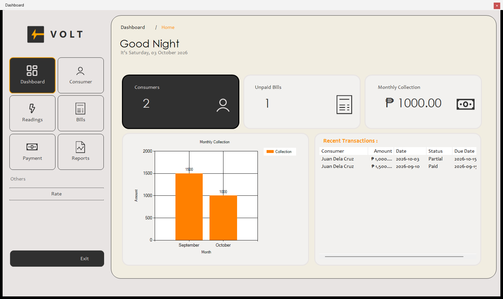
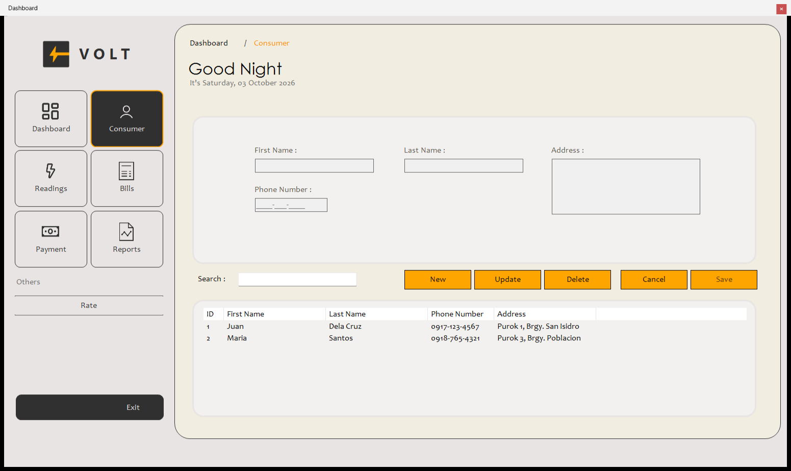
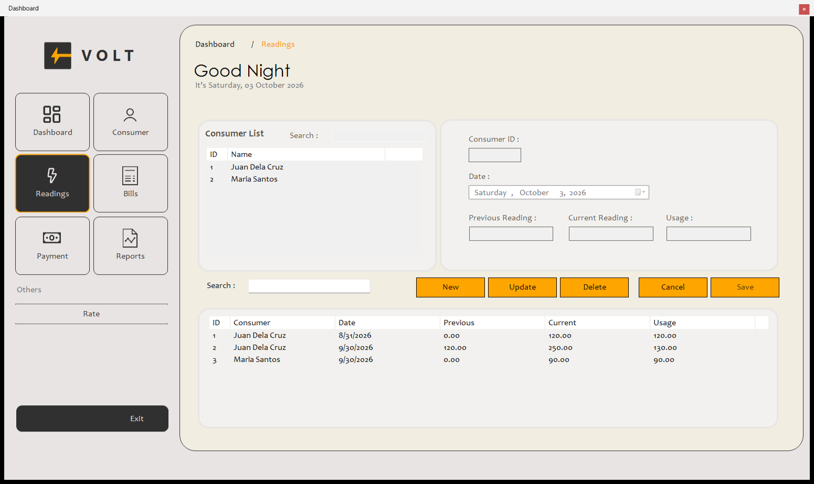
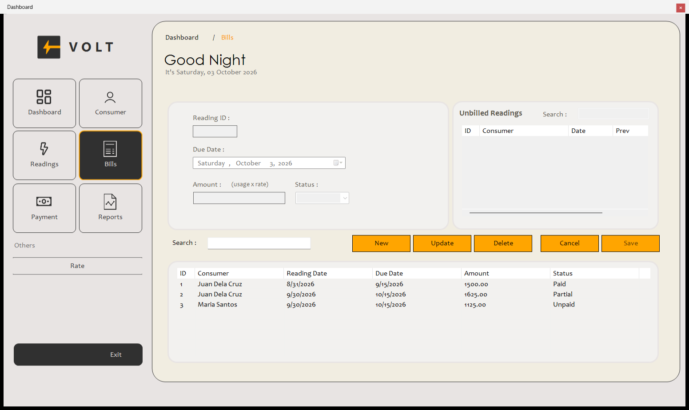
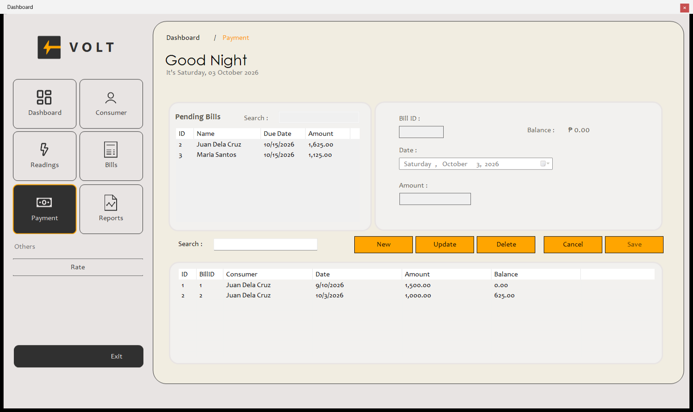
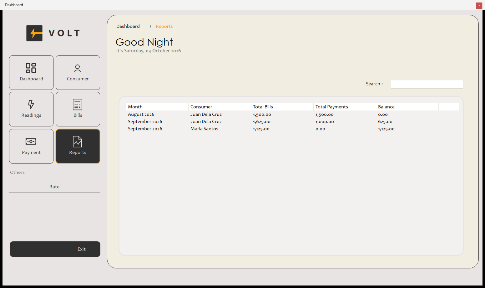

<p align="center">
  
</p>

<p align="center">
  
  
  
  
  
</p>

<p align="center">
  <b>Download v0.1.1:</b>
  <a href="https://github.com/nncast/vb.net-billing-collection-system/releases/download/v0.1.1/BillingAndCollectionSystem-v0.1.1-Windows.zip">Windows (.zip)</a> ·
  <a href="https://github.com/nncast/vb.net-billing-collection-system/archive/refs/tags/v0.1.1.zip">Source (.zip)</a> |
  <a href="https://github.com/nncast/vb.net-billing-collection-system/releases">All releases</a>
</p>

# BillingAndCollectionSystem

**BillingAndCollectionSystem** is a desktop application developed in **VB.NET** designed for utility service providers to manage consumer billing and payments.
It allows administrators to create consumer records, generate electricity bills based on meter readings, and track collections and payments.

> **Current version: v0.1.1** — bug-fix and security release: bill status and partial payments are always right, overpayments are blocked, every query is parameterized, the connection settings live in a config file, and there is a ready-to-run Windows build. See [Releases](https://github.com/nncast/vb.net-billing-collection-system/releases) for the release notes.

<p align="center">
  
  
  
  
  
  
</p>

## Features

- Register and manage consumer information
- Record meter readings and generate monthly electricity bills
- Track billing history and payment status
- Record partial or full payments
- Windows Forms interface with MySQL database integration

## Development environment

| Category | Details |
| --- | --- |
| Language | Visual Basic .NET |
| UI | Windows Forms |
| Framework | .NET Framework 4.8.1 |
| Database | MySQL / MariaDB (XAMPP or WAMP) — database `dbbilling` |
| Driver | MySql.Data (MySQL Connector/NET) |
| IDE | Visual Studio 2012 or later |

## Requirements

| Tool | Download |
| --- | --- |
| Visual Studio 2012 or later | [visualstudio.microsoft.com](https://visualstudio.microsoft.com/downloads/) |
| .NET Framework 4.8.1 or later | [dotnet.microsoft.com](https://dotnet.microsoft.com/en-us/download/dotnet-framework/net481) |
| XAMPP or WAMP (for MySQL) | [XAMPP](https://www.apachefriends.org/index.html) · [WAMP](https://www.wampserver.com/en/) |
| SQLYog or any MySQL client | [SQLYog](https://github.com/webyog/sqlyog-community/wiki/Downloads) |
| MySQL .NET Connector (`MySql.Data.dll`) | Included in `lib/` (from [Connector/NET](https://dev.mysql.com/downloads/connector/net/)) |

## Setup and run instructions

**Windows build (no Visual Studio needed)**

1. Download [`BillingAndCollectionSystem-v0.1.1-Windows.zip`](https://github.com/nncast/vb.net-billing-collection-system/releases/download/v0.1.1/BillingAndCollectionSystem-v0.1.1-Windows.zip) from the [v0.1.1 release](https://github.com/nncast/vb.net-billing-collection-system/releases/tag/v0.1.1) and extract it.
2. Start MySQL (XAMPP, WAMP, or another server) and import `database/dbbilling.sql` from the extracted folder.
3. If your MySQL server, port, user or password differ from `localhost:3306` / `root` / no password, open `BillingAndCollectionSystem.exe.config` in Notepad and edit the `BillingDb` connection string.
4. Run `BillingAndCollectionSystem.exe`.

**From source**

1. Clone the repository, or download the [source .zip](https://github.com/nncast/vb.net-billing-collection-system/archive/refs/tags/v0.1.1.zip).
   ```bash
   git clone https://github.com/nncast/vb.net-billing-collection-system.git
   ```
2. Start MySQL using XAMPP, WAMP, or another server stack.
3. Import `database/dbbilling.sql` with SQLYog or another MySQL client, or from the CLI:
   ```bash
   mysql -u root -p < database/dbbilling.sql
   ```
   It creates the `dbbilling` database with sample consumers, readings, bills and payments, plus a starting rate of ₱12.50/kWh. Keep at least one rate: bills are priced with the newest one.
4. Open `BillingAndCollectionSystem/BillingAndCollectionSystem.sln` in Visual Studio.
5. If your MySQL settings differ from the defaults, edit the `BillingDb` connection string in `BillingAndCollectionSystem/BillingAndCollectionSystem/App.config`. `MySql.Data.dll` ships in the repository's `lib` folder, so nothing else needs to be installed for the reference.
6. Build and run the project.

---

*BillingAndCollectionSystem · 2025 · VB.NET · Windows Forms · .NET Framework 4.8.1 · MySQL*
